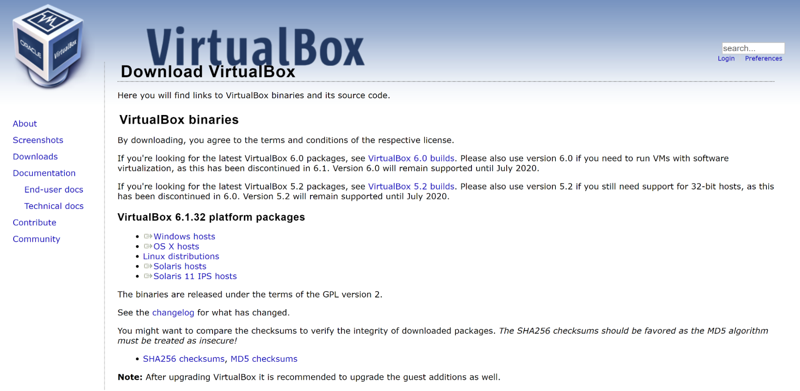

# walkthrough-for-Linux-virtual-machine

<h1>About VirtualBox</h1>
VirtualBox is an open-source hypervisor that is developed by Oracle. It is similar to an emulator that creates and runs VMs where we can install different OSs without having to tinker with our disk partitions or worrying about impacting our primary OS. Instead, we run a different OS like Ubuntu as if it were another program running on our computer.
Installing VirtualBox
To install VirtualBox, first, go to the download page on the VirtualBox website. Select and download the correct package for your primary OS (the host OS, in virtualization terminology).

 
Once the package is installed, install VirtualBox as you would typically install a program. Feel free to use the default installation options.
Create a VM
Provisioning a machine
Once VirtualBox is installed on your machine, start the program and you should see the VirtualBox Manager window open.
 
In this screen you will see options to create and add VMs to VirtualBox, as well as any VMs you have previously created.
Select the “New” button to create a new VM. The prompt will ask for a name for the VM, a file path for where to save the VM files. There are options for the “type” of OS you would like to install on your VM, such as Windows, macOS, or Linux. It will also ask for the “version” of the OS you will install, such as Ubuntu or Debian.
For this tutorial please select Linux for the “Type”, Ubuntu (64-bit) for the “Version”, and select “Next”.
 
The following screen will ask to select the memory size to allocate for your machine. This will set aside a certain amount of RAM on your host machine to be used for your VM when it is running.
Please allocate 1024 MB and select “Next”.
 
The next step is to create a virtual hard disk for your VM which is where files and programs will be saved when operating your VM. Please select “Create a virtual hard disk now” and then click the “Create” button.
 
You will then be prompted to select the type of hard disk file. Select “VDI (VirtualBox Disk Image)” and click on “Next”.
 
Select whether the new virtual disk should be of a “fixed size” or dynamically allocate space as it fills up. Select “Dynamically allocated” and click “Next”.
 
Then set the maximum size for the disk to store file data, and then click “Create” to finish provisioning the VM.
 
VirtualBox will bring you back to the main screen where you can see your newly created VM.
Ubuntu
Download Ubuntu
In order to install an OS to a VM you will need to install the OS just like you would on a regular computer. You’ll need to download a copy of the installation.
The latest version LTS version of Ubuntu (as of early 2022) can be downloaded for free here.
 
Installing the OS
Now you should have everything ready to install Ubuntu. From the VirtualBox Manager screen, double click the VM you created on the left and a prompt will appear asking to select the start-up disk. Use the dropdown menu to select the Ubuntu image that you downloaded in the previous step and click “Start” to boot the VM.
 
VirtualBox will open a new window where you can see the display for your VM! From this point on, all these instructions take place in the VirtualBox window loading Ubuntu.
The VM will boot to a welcome screen where you can select “Install Ubuntu” to start the installation process. Follow the prompt to select your Keyboard Language. A normal installation will include a number of apps and software whereas a minimal installation will only include basic utilities and you can install your own as you go. We’ll use the normal installation for this tutorial. You can check “Download updates” to update software packages as part of the installation process.
 
In the next screen, select “Erase disk and install Ubuntu”. Don’t worry! This takes place inside your VM and won’t affect your primary disk. Click “Install now” to continue. Ubuntu will prompt you to select your location and create a username and password. Afterwards, the installation will begin.
 
The installation can take a bit of time depending on your installation type and your internet speed:
 
When the installation finishes, restart the VM in order to use it:
 
After restarting the VM you can log into your account and use your Ubuntu machine! Since our Ubuntu installation is completely contained within a VM, it’s practically impossible to screw up your host computer.
 
Conclusion
Now you can feel free to play around, try out the programs, new commands, install random software, and explore without fear of breaking anything. The only thing you can accidentally impact is the VM but it can simply be deleted and reinstalled again!

